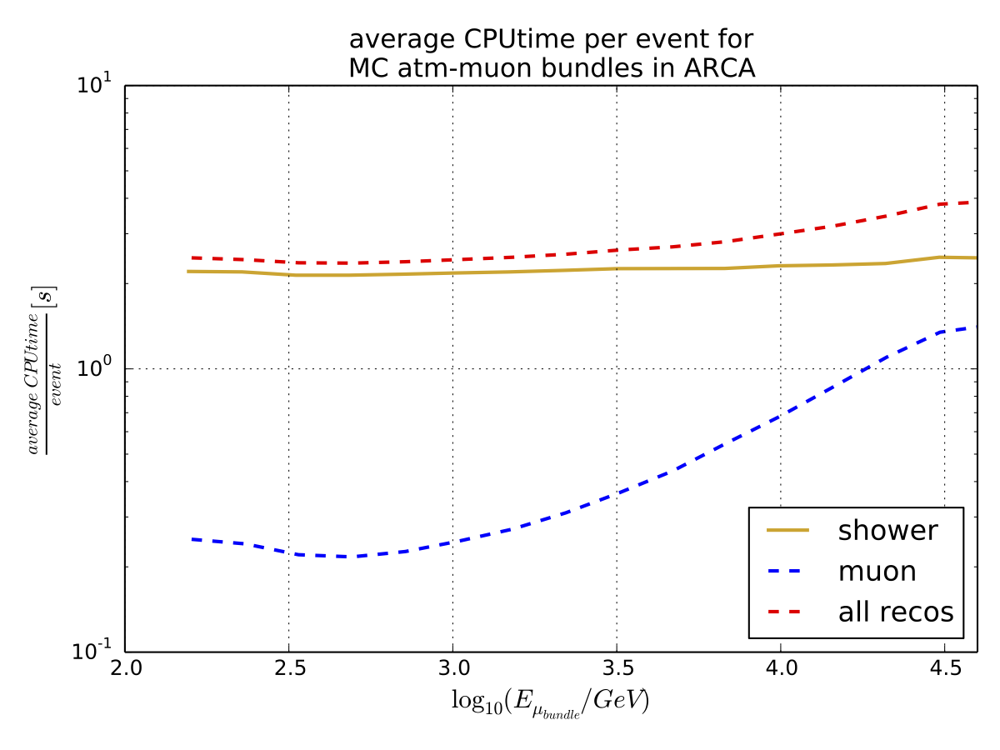
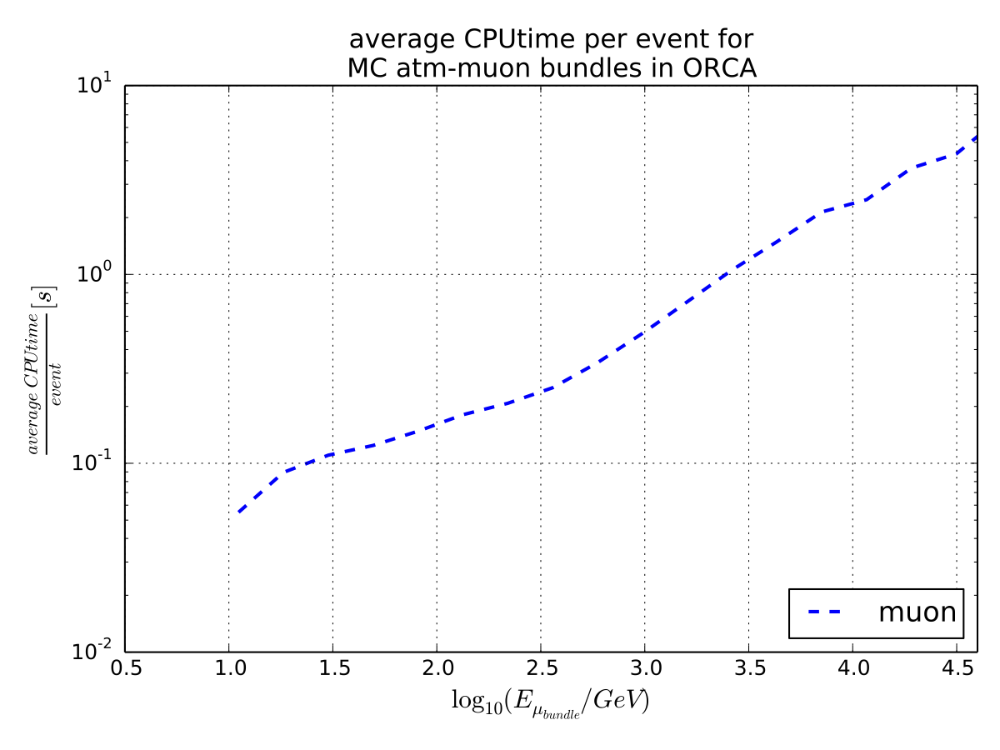

Introduction
============

This project is a proposal for an online reconstructions system (ORS) in the KM3NeT neutrino telescope, which is already operative in ORCA and ARCA 1-detection unit.

In summary, **what it does**, as soon as an DAQ event is created, this is sent to the ORS through socket connection. Subsequently, from the DAQ event the hits are obtained and the directional recontructions are ran. To achieve the reconstructions of all the vents in real time, multi-processes are created which are subsequently connected through a single listener.  

Physics context
---------------

Followed by the first observation of high-energy extra-terrestrial neutrinos at the IceCube neutrino observatory in 2013, the era of the high-energy neutrino astronomy opened up. Due to the special neutrino features, those become interesting particles to study astrophysical phenomena, which are, low cross section compared to other fundamental interactions, and no electric charge. The former implies low probability of interaction with matter as intergalactic media, whereas the latter infers that neutrinos are invisible to magnetic fields in the Universe. Therefore, a neutrino observation in a dedicated detector at Earth, as in the KM3NeT neutrino observatory, can be tracked back towards the sky, and subsequently providing information of the neutrino source.

Neutrinos in combination with Cosmic rays, electromagnetic radiation and Gravitational waves are well-known as the astrophysical multi-messengers. Astrophysical multi-messengers are expected to be emitted from the most violent phenomena in the Universe, e.g., Gamma Ray Bursts, Active Galactic Nuclei and the merging of two super dense astronomical objects. All these astronomical messengers have been observed by dedicated instruments at ground and in the space.

However, a single observation at Earth of one of these multi-messengers cannot revel by itself the kind of processes that are taking place in a certain astronomical source, hence, that observation have to be accompanied by another astrophysical messenger. For example, the kind of processes that originate the gamma rays as detected by Fermi, H.E.S.S and other dedicated telescopes, is not fully understood. Such an emission can be attributed to leptonic and/or hadronic processes, which can be disentangled only if neutrinos and gamma rays are observed from a certain source. This correlation is due to the fact that high-energy astrophysical neutrino emission is only associated to hadronic processes.  

The KM3NeT neutrino observatory searches for astrophysical neutrinos. KM3NeT encompasses two dedicated devices for detecting neutrinos, ARCA and ORCA, which are placed in France and Italy respectively. These two detectors are extensive devices with a volume of a cubic kilometre per building block. ARCA detector comprises two building blocks submerged 3.5 kilometres under the sea, whereas the ORCA consists of a single building block submerged 2.5 kilometres under the sea.
KM3NeT then will be able to send and receive alerts to partner observatories under MoU, in order to initiate a search for an emission counterpart. Moreover, contrary to electromagnetic observatories, KM3NeT as a neutrino telescope will be able to observe the full sky XXYY% per year, which will be a tremendous contribution to electromagnetic observatories that have a reduced field of view.

Due to the fact that astrophysical phenomena might last a short time window, a fast system to obtain the main observables from a neutrino event, as direction and energy, has to be implemented in KM3NeT. Therefore, an online or real-time system has to be equipped in KM3NeT in order to accomplish multi-messenger studies.
In this document, we explain the proposal for the online system in KM3NeT, which includes a distribution system that allows to reconstruct events in parallel, and the performance of the online directional reconstructions.

Plan
----

The online reconstructions algorithms have been recently implemented, and are idem as the ones used for offline analyses in KM3NeT. However, the code design for these algorithms have been modified in order to cope with event by event analyses, as needed for the ORS. 

A first stage of the reconstruction algorithms is to access to the DAQ information, which provides the main information of an event, this is “the hits” as registered by the thousands PMTs. Secondly, the reconstruction algorithms are ran, which is initiated for the search for the best direction that fits a certain hit clustering.  Finally, the reconstruction algorithm considers the probability that an observed hit is emitted from a certain PMT. 

The event rate at trigger level is completely dominated by atmospheric muon, which are induced by cosmic ray interactions with the terrestrial atmosphere. Followed by a first event filtering as performed by JDataFilter, this background rate in ARCA and ORCA is around of 50 Hz. As the figures below expose, the CPU time needed to process the muon and shower reconstructions can be conservatively set at 4 seconds per event (see figures below), therefore, 200 CPU cores are needed per building block (as discussed in a `DAQ meeting`_). Note that the event rate quoted above does not include random noise, which can be produced by the presence of K40 and bioluminescence in the sea water. This random background could eventually be removed with a minimal impact on the astrophysical high-energy neutrino signal.

.. _DAQ meeting: https://elog.km3net.de/DAQ+Readout/131

The current work is a first phase for a proposal for an online reconstruction system. This system consists in receiving DAQ data via socket connection, and is decoupled from the offline data taking. Therefore, the reconstruction applications (processes) act as servers which wait for data for processing the reconstructions. Several applications run in parallel then, which are connected via socket to an online-server (JLigier) that works as a listener. The function of this server is to provide data to multiple applications which have the responsabilities of performing an online event selection and handle alerts, write files, produce graphic representation for selected events, etc.

The content outlined above has been successfully used for ORCA and ARCA, both consiting of one detection unit.   

.. image:: arca_rate_energy.png
   :width: 49%

The figure above on the left represents the full atmospheric muon event rate at trigger level for ARCA as given in a Monte Carlo data set for 1-building block. The horizontal axis shows the full energy of the muon bundle.  The low energy component has a low rate due to the fact that they do not trigger the detector.  No random noise is included.
The figure on the right exposes the CPU time per event as observed in the ARCA detector. Herein the performance of both algorithm, shower and muon, is displayed,  

The figure below are as the one above but for the ORCA counterpart, where the consuming cpu time is for the muo reconstrution only.

.. image:: orca_rate_energy.png
   :width: 49%

